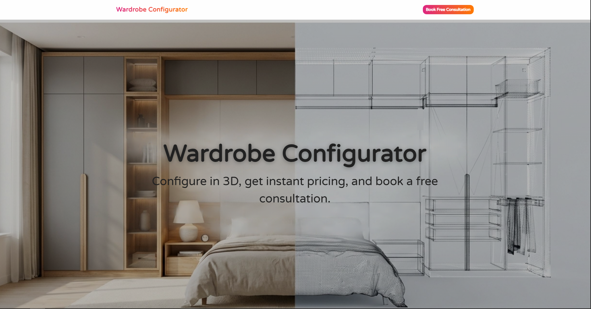
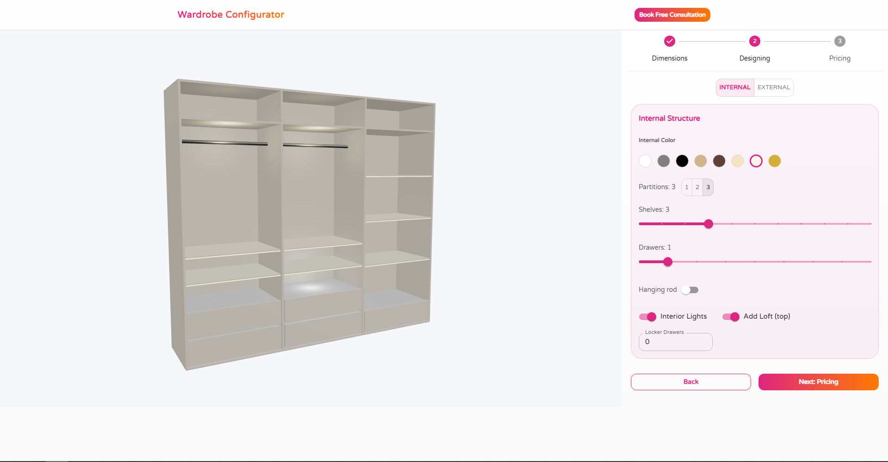

# Wardrobe-Configurator-ui


Its a web-based interactive wardrobe design tool that allows users to create, customize, and visualize wardrobe layouts in real time using **2D and 3D rendering**.

🔗 **Live Demo:** https://wardrobe-3d.vercel.app/  
🔗 **Repository:** https://github.com/Manish1194/wardrobe-configurator-ui  

---

## 🚀 Features

- 🧩 **Interactive Layout Builder** – Design and customize wardrobe structures dynamically  
- 🎨 **2D Rendering (Canvas API)** – Real-time visual updates for layout planning  
- 🧊 **3D Visualization (Three.js)** – View wardrobe designs in an immersive 3D environment  
- ⚡ **Real-time State Management** – Instant updates on user interactions  
- 📐 **Scalable Component Architecture** – Modular and reusable React components  
- 🚀 **Production Deployment** – Hosted on Vercel for fast and reliable access  

---

## 🏗️ Tech Stack

- **Frontend:** React 18, TypeScript, Vite  
- **Rendering:** Canvas API, Three.js  
- **Styling:** CSS Modules  
- **Tooling:** ESLint  

---

## 🧠 Architecture Overview

The application is designed with a focus on **performance and scalability**:

- Component-driven architecture using React  
- Efficient state management for handling complex layout configurations  
- Separation of rendering logic (Canvas / Three.js) from UI components  
- Optimized rendering pipeline for smooth interactions in graphics-heavy scenarios  

---

## 📸 Screenshots



## ⚡ Getting Started

### Install dependencies
```bash
npm install
```

### Development Server
```bash
npm run dev
```
Open [http://localhost:5173](http://localhost:5173) to view it in the browser.

### Build for Production
```bash
npm run build
```

### Preview Production Build
```bash
npm run preview
```

## Project Structure

```
├── src/
│   ├── App.tsx           # Main component
│   ├── App.css          # Component styles
│   ├── main.tsx         # Entry point
│   ├── index.css        # Global styles
│   └── vite-env.d.ts    # Type definitions
├── index.html           # HTML entry point
├── package.json         # Dependencies
├── tsconfig.json        # TypeScript config
├── vite.config.ts       # Vite configuration
└── eslint.config.js     # ESLint configuration
```
## 💡 Key Engineering Challenges

- Managing complex UI state for dynamic layout customization
- Optimizing rendering performance for real-time interactions
- Integrating 2D and 3D visualization layers seamlessly
- Ensuring responsive and smooth UX across devices

## Available Scripts

- `npm run dev` - Start development server
- `npm run build` - Create production build
- `npm run preview` - Preview production locally
- `npm run lint` - Check code quality

## Browser Support

- Chrome (latest)
- Firefox (latest)
- Safari (latest)
- Edge (latest)

## Learn More

- [Vite Documentation](https://vitejs.dev/)
- [React Documentation](https://react.dev/)
- [TypeScript Documentation](https://www.typescriptlang.org/)
